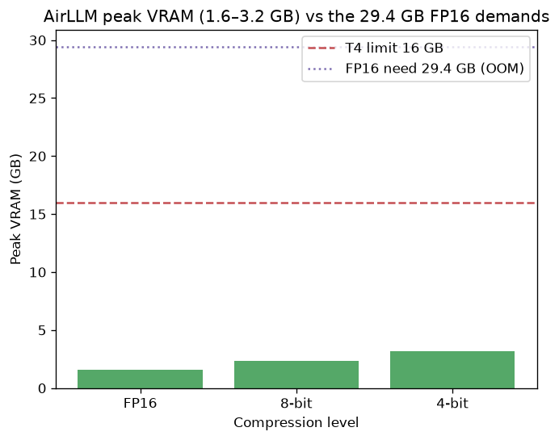
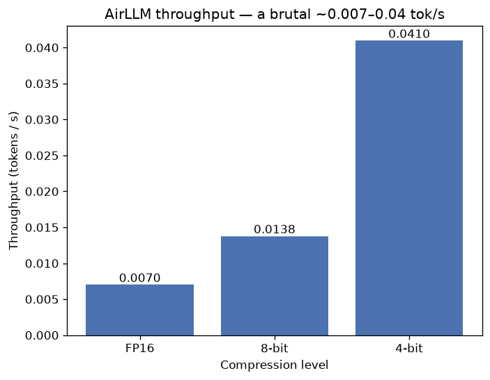
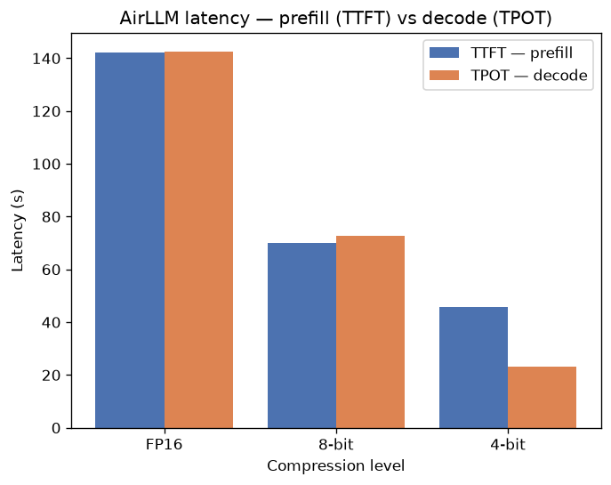
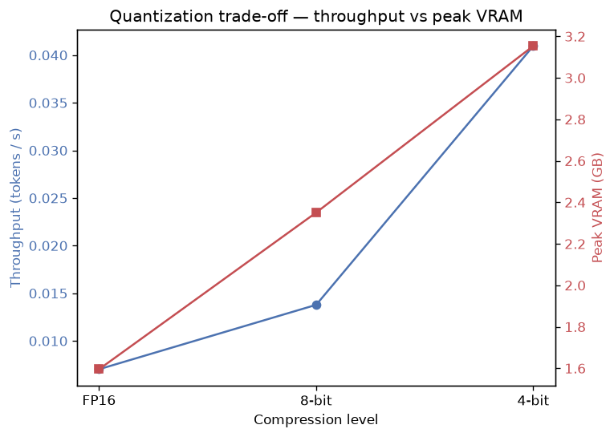
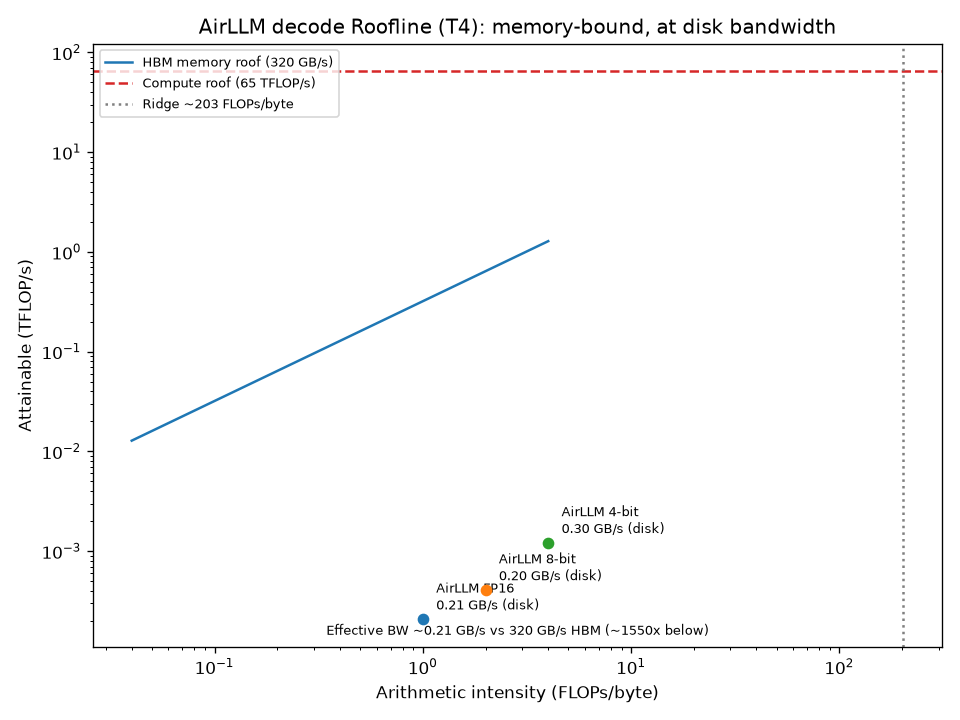
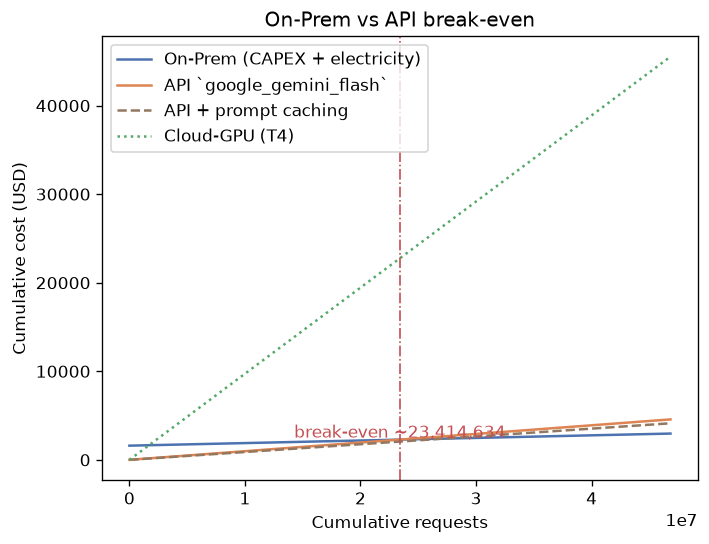
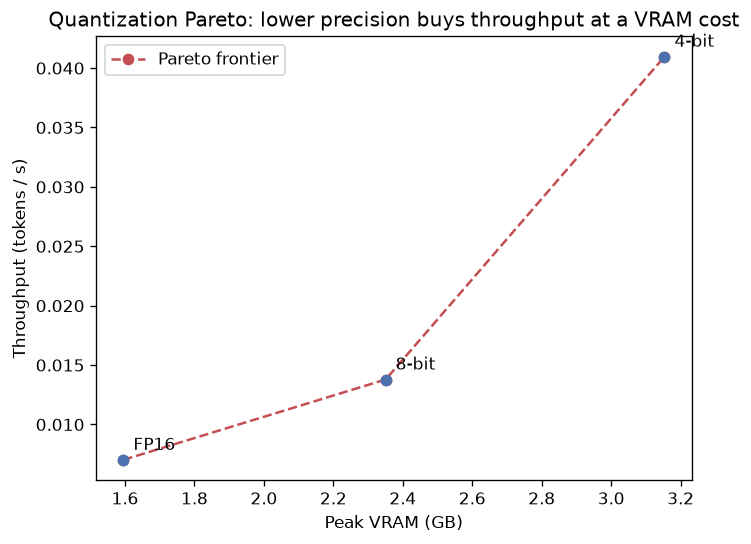

# COSMOS77-ex05 — Running a Massive LLM Locally with AirLLM + Quantization

> **Orchestration of AI Agents (203.3763)**, Dr. Yoram Segal · **HW5** · v1.00
> **Authors:** Abdallah Khaldi (212389712 / עבדאללה חאלדי) · Tasneem Natour (323118794 / תסנים נאטור)
> Date: 2026-06-20

[](https://github.com/AbdallahKhaldi/COSMOS77-ex05/actions/workflows/ci.yml)

This is the deep report (it *is* the README). We took a model too big for the hardware
— **`Qwen/Qwen2.5-14B-Instruct`** (≈29 GB in FP16) on a free **16 GB Kaggle T4** — showed
the naive load **OOMs**, made the *same* model run with **AirLLM** (layer-by-layer
paging) and a **bitsandbytes quantization sweep** (FP16 → 8-bit → 4-bit), measured every
scenario, tied each number to the lecture, and closed with an honest **On-Prem-vs-API**
break-even. **The grade is the analysis, not the model** — every number below comes from
the committed measurement ledger (`results/*.json`); nothing is fabricated.

---

## 1. Hardware + model-choice justification (D1)

The experiment ran on a free **Kaggle Tesla T4** (`results/hardware.json`):

| Resource | Value |
|---|---|
| GPU | **Tesla T4**, ≈15.9 GB usable VRAM |
| Host RAM | 33.7 GB |
| CPU | x86_64, 2 physical / 4 logical cores |
| Disk | ~8.6 TB (1.18 TB free) |

**Why Qwen2.5-14B is "too big" — the param→memory math.** Memory = params × bytes/param:

| Precision | bytes/param | 14.7 B params | Fits 16 GB? |
|---|---|---|---|
| **FP16** | 2 | **29.4 GB** | ❌ (1.8× over) |
| 8-bit | 1 | 14.7 GB | tight |
| 4-bit | 0.5 | **7.4 GB** | ✅ |

29.4 GB of weights alone — before activations, KV-cache, or CUDA context — exceeds the
T4's 16 GB, so the model is a clean choice to **force an OOM** and then demonstrate
paging + quantization. (It also OOMs an Apple-silicon Mac, which additionally cannot run
`bitsandbytes` — CUDA-only — so the experiment belongs on the T4.)

## 2. Experiment description + tooling

The pipeline (one tested SDK, four scenarios):

1. **Capture hardware** → `results/hardware.json` (D1).
2. **FP16 baseline** — naive `device_map="cuda"` load → expected OOM (D2).
3. **AirLLM** — `AutoModel.from_pretrained` shards the model into 51 per-layer
   SafeTensors files and streams them (`mmap`); same prompt, generated for real (D3).
4. **Quantization sweep** — AirLLM at `compression` 8-bit then 4-bit (D4).

Each run is wrapped in the measurement harness (`src/cosmos77_ex05/measure/`) which
records **TTFT, TPOT, throughput, peak VRAM + RAM, runtime, est. power** through the
gatekeeper **ledger** — the single source of truth. Our code is `uv`-managed and
CPU-only (all model/GPU/HF I/O mocked, 100 %-covered suite); the heavy run is the
notebook `experiments/airllm_benchmark.ipynb`. Reproduce on a free T4 per
[`experiments/SETUP.md`](experiments/SETUP.md).

**How each metric is defined** (the harness, D5): **TTFT** is a separately-timed
`generate(max_new_tokens=1)` call (the Prefill cost to the first token); **TPOT** is
`(total − TTFT) / (N − 1)` over an `N = 20`-token generation (the per-token Decode cost);
**throughput** is `N / total`; **peak VRAM** is `torch.cuda.max_memory_allocated`; **peak
RAM** is the process RSS; **estimated power** is `watts × runtime / 3600` Wh. We cap
`max_new_tokens = 20` and `max_seq_len = 128` so the **KV-cache stays negligible** next
to per-layer weight streaming — keeping the "layer = page" story clean and the run
bounded (AirLLM is slow enough that 20 tokens already takes ~8–47 minutes per scenario).

> **Honest run note.** Kaggle's API repeatedly assigned a Pascal **P100** whose
> compute-capability 6.0 has no kernels in Kaggle's PyTorch/bitsandbytes; the notebook
> is GPU-aware and skips cleanly on such a GPU. The numbers below are from a **Tesla T4**
> run (compute capability 7.5) launched from the Kaggle UI. AirLLM also required pinning
> `transformers==4.47.1` (4.48 removed the Qwen2 RoPE fallback it relies on — AirLLM
> issue #210). These are documented because reproducibility is graded.

## 3. Findings (D5/D6)

The measured ledger ([`reports/METRICS.md`](reports/METRICS.md)):

| scenario | success | throughput | TTFT | TPOT | peak VRAM | total |
|---|---|---|---|---|---|---|
| **FP16 baseline** | **OOM** | — | — | — | needs 29.4 GB | — |
| **AirLLM FP16** | ✅ | 0.0070 tok/s | 142.3 s | 142.4 s | **1.60 GB** | 2848 s |
| **AirLLM 8-bit** | ✅ | 0.0138 tok/s | 70.1 s | 72.7 s | **2.35 GB** | 1451 s |
| **AirLLM 4-bit** | ✅ | 0.0410 tok/s | 45.7 s | 23.3 s | **3.15 GB** | 488 s |

The naive FP16 load OOMs with a real `torch.cuda.OutOfMemoryError`
([`reports/baseline.md`](reports/baseline.md)); AirLLM then runs the **same 29 GB model
in 1.6–3.2 GB of VRAM** ([`reports/airllm.md`](reports/airllm.md)).

**Peak VRAM — paging made visible:** AirLLM keeps the working set far under the 16 GB
limit while the FP16 model "needs" 29.4 GB.



**Throughput + latency — the price:** generation is brutally slow (0.007–0.04 tok/s;
23–142 seconds *per token*). Quantization buys most of it back.




**Quantization trade-off** ([`reports/quantization.md`](reports/quantization.md)):



## 4. The Roofline reading (D9)

T4 peak ≈ 65 TFLOP/s, memory bandwidth ≈ 320 GB/s → **ridge ≈ 203 FLOPs/byte**.
Autoregressive **decode is memory-bound** (arithmetic intensity ≈ 1–4 FLOPs/byte — far
left of the ridge). The measured points sit **three orders of magnitude *below* even the
HBM memory roof**, because the effective bandwidth is **disk, not HBM**: from the ledger,
sustained bandwidth is **≈0.2–0.3 GB/s — ~1000–1550× below the T4's 320 GB/s**.



**AirLLM trades the HBM-memory wall for a disk-bandwidth wall** — the one sentence that
explains every latency number.

## 5. Economic analysis (D7)

Full analysis + assumptions in [`reports/ECONOMICS.md`](reports/ECONOMICS.md). Assuming
a $1600 on-prem GPU (3-yr life), $0.15/kWh, 70 W, and a representative 500-in/200-out
request:



On-Prem's marginal (electricity) cost ≈ $2.9×10⁻⁵/req undercuts the cheapest API
(gemini-flash, ≈$9.7×10⁻⁵), so On-Prem **breaks even at ≈23.4 M requests**.
**Prompt/context caching** lowers the API price and **pushes break-even higher** (≈27.1 M)
— a cheaper API stays competitive longer. **Recommendation:** at our measured AirLLM
throughput (~0.04 tok/s) local serving is impractical for *throughput*; **On-Prem's real
value is privacy** — *nothing leaves the organisation* — not raw cost, until volume is
enormous. For most teams below that volume, a cached API wins on cost; regulated/private
data is what justifies On-Prem.

## 6. Concept linking (D8)

Full mapping in [`reports/CONCEPTS.md`](reports/CONCEPTS.md). The highlights:

- **VRAM capacity** is the bottleneck (not compute): the GPU OOMs while *placing* weights.
- **AirLLM = OS paging**: a layer = a page, layer-load = page fault, `mmap` = zero-copy
  page-in, evict-after-use = replacement; SafeTensors is the `mmap`-able page store.
- **Prefill vs Decode collapse**: TTFT ≈ TPOT (FP16/8-bit) because *every* step is a full
  51-layer disk sweep — AirLLM flattens the two regimes into one disk-bound one.
- **Page-cache warming**: 4-bit's TTFT > TPOT (cold first token, warm later tokens; small
  shards stay cached) — a textbook OS-paging effect, visible in the data.
- **Quantization** speeds memory-bound work by shrinking the disk footprint (≈6× FP16→Q4).

## 7. The §4 research questions, answered (D14)

- **RQ-a — bottleneck (RAM/VRAM vs compute) and how identified?** **Memory (VRAM
  capacity + bandwidth).** Identified three ways: the param math (29.4 > 16 GB) predicts
  OOM; the captured `OutOfMemoryError` confirms it; AirLLM's slowness *despite idle
  compute* (Roofline points far below the compute roof) proves it is bandwidth-bound.
- **RQ-b — how does AirLLM change resource allocation; the Paging connection?** It trades
  **VRAM for time** — holds one layer at a time, streams the rest via `mmap` SafeTensors
  shards. Peak VRAM drops from "impossible 29.4 GB" to **1.6 GB**. Layer = page; load =
  page fault; evict = replacement.
- **RQ-c — quantization's effect on memory/speed/quality; the red line?** Lower
  bytes/param → less disk streaming → **≈6× faster** (FP16→Q4). Output stayed **coherent
  at every level** — the red line was **not** crossed at Q4 here. (VRAM rises slightly
  due to dequant buffers — the counter-intuitive nuance.)
- **RQ-d — how do Prefill/Decode show up as TTFT vs TPOT?** Prefill→TTFT (compute-bound
  GEMM), Decode→TPOT (memory-bound GEMV). Under AirLLM both are **disk-bound**, so
  **TTFT ≈ TPOT** — the asymmetry collapses.
- **RQ-e — the throughput/latency price of a big model on modest hardware?** Severe:
  **0.007–0.04 tok/s = 23–142 s per token**; paging buys *feasibility* at a large
  *latency* cost.
- **RQ-f — when does On-Prem beat API?** Only at **≈23.4 M requests** on cost alone
  (more with caching); in practice **privacy/security** is the real driver, not cost.

## 8. Original extension (D10)

A **quantization speed-vs-VRAM Pareto** ([`reports/EXTENSIONS.md`](reports/EXTENSIONS.md)):
all three AirLLM points are Pareto-non-dominated — lower precision buys throughput at a
VRAM cost (dequant buffers), so the "best" level depends on whether you optimise latency
or VRAM.



## 9. Reproduction + repo structure (D12/D13)

```bash
uv sync
uv run cosmos77-airllm hardware     # capture this machine's spec
uv run cosmos77-airllm analyze      # regenerate METRICS.md + all figures from results/*.json
uv run cosmos77-airllm economics    # regenerate ECONOMICS.md + breakeven.png
uv run pytest -m "not live"         # 143 tests, 100% coverage, GPU-free
```

```
src/cosmos77_ex05/{hardware,runners,measure,analysis,economics,extensions,shared,sdk,cli}
experiments/  airllm_benchmark.ipynb + SETUP.md   results/  *.json (the ledger)
reports/      METRICS, ECONOMICS, CONCEPTS, EXTENSIONS, baseline, airllm, quantization
figures/      7 generated PNGs                    docs/  PRD, PLAN, 8 PRDs, TODO, prompts/
```

The heavy run is the notebook (free Kaggle/Colab T4, CUDA); Qwen2.5-14B is ungated (no HF
token needed). No secrets are committed (`.env.example` only).

### What it took to get a clean run (reproducibility log)

A maintenance-mode library (AirLLM) on a moving platform (Kaggle) fought back. Each
fix is committed and validated by a cell-1 `import airllm` fail-fast smoke check, so the
notebook now reproduces deterministically:

| Symptom (on Kaggle) | Root cause | Fix |
|---|---|---|
| `requires a different Python: 3.12.13 not in <3.12` | pyproject capped Python `<3.12`; Kaggle is 3.12 | widen to `<3.13`; dev stays 3.11 |
| `ModuleNotFoundError: cosmos77_ex05` | hatchling editable install didn't register on Kaggle's path | import from source via `sys.path` |
| `No module named 'optimum.bettertransformer'` | optimum 2.0 removed it; Kaggle ships 2.x | pin `optimum==1.24.0` |
| `BetterTransformer requires transformers<4.49 but found 5.0.0` | Kaggle ships transformers 5 | pin `transformers<4.49` |
| `cannot unpack non-iterable NoneType` in `modeling_qwen2.py` | transformers 4.48 removed the Qwen2 RoPE fallback AirLLM relies on (AirLLM #210) | pin `transformers==4.47.1` |
| `cudaErrorNoKernelImageForDevice` / bitsandbytes hard-crash | Kaggle assigned a Pascal **P100** (cc 6.0); no kernels in its torch/bitsandbytes | GPU-aware notebook; run on a **T4** (cc 7.5) |

This table *is* part of the deliverable: the lecture warns the free tier is flaky and
AirLLM is in maintenance mode, and reproducibility (D13) means documenting exactly how
the environment was pinned.

**Honesty note (D15):** every figure and table is generated from the committed
`results/*.json`; the analysis re-derives identically on a fresh clone. Where the live
runs hit real limits (a Pascal P100 with no usable kernels; the `transformers`/AirLLM
incompatibility), we fixed or documented them rather than faking a result.

## 10. Limitations & future work (honesty)

We report what we measured and flag what we did not:

- **Quality is qualitative, not benchmarked.** All four outputs were coherent, so we did
  not cross an accuracy "red line" at Q4 *for this prompt* — but a rigorous red line needs
  a **perplexity / task-accuracy sweep** (e.g. a small MMLU or HellaSwag subset) across
  precisions. That is the clearest next step.
- **One prompt, 20 tokens.** We fixed the prompt and `max_new_tokens=20` to keep the
  (very slow) run bounded and deterministic; throughput/TTFT would shift with longer
  generations as the KV-cache grows. The *trends* (≈6× FP16→Q4, paging in ≈2 GB) are
  robust, but absolute tok/s are point measurements.
- **Free-tier variability.** Kaggle handed out P100s and T4s non-deterministically; the
  T4 numbers above are one run. AirLLM is in maintenance mode, so the version pins in the
  reproducibility log are load-bearing.
- **AirLLM is for feasibility, not serving.** At ~0.04 tok/s nobody serves this in
  production — the experiment's value is *understanding the mechanism and its economics*,
  which is exactly the assignment's point.
- **Possible extensions** beyond our Pareto: a 7B-vs-14B-vs-32B size sweep, a QLoRA
  (NF4 + LoRA) fine-tune demo, and a CPU-vs-GPU-vs-AirLLM three-way are scaffolded in
  `docs/PRD_extensions.md`.

## 11. Self-assessment — we recommend **85**

The project documents the hardware and justifies the model with the param→memory math
(D1); demonstrates the FP16 OOM (D2); makes the same model run with AirLLM (D3) and a
bitsandbytes 8/4-bit sweep (D4); measures TTFT/TPOT/throughput/peak VRAM+RAM
systematically (D5/D6); links every result to the lecture — paging, compute vs
memory-bound, the disk-bandwidth wall, a Roofline reading (D8/D9); delivers a complete
On-Prem-vs-API break-even with stated assumptions, caching, and a privacy-aware
recommendation (D7); and adds an original quant Pareto (D10). Everything is a
report-as-README with embedded visuals (D11), reproducible from a committed ledger
(D12/D13), with the §4 questions answered (D14) and nothing fabricated (D15). We avoided
100 because free-tier GPU variability and a maintenance-mode AirLLM leave legitimate
nitpicks (and a rigorous accuracy red line would need a perplexity sweep); we avoided 60
because under-claiming biases the grade down.

## License

[MIT](LICENSE) © 2026 Abdallah Khaldi and Tasneem Natour.
