# PLAN — COSMOS77-ex05 Architecture

> **HW5 — Running a Massive LLM Locally: AirLLM, Quantization & Performance Benchmarking**
> Orchestration of AI Agents (203.3763) — Dr. Yoram Segal (UOH).
> The grade is the **analysis**, not the model. This document is the architectural plan: the C4 views, the
> end-to-end experiment sequence, the Architecture Decision Records, and the risk register. Every measured number
> is produced live on a free Kaggle T4 and flows through the **measurement ledger** (`shared/gatekeeper.py` →
> `results/*.json`), which is the single source of truth for every table, graph and claim.

---

## 1. C4 architecture model

### 1.1 Context (level 1)

The **student-engineer** drives one tool, the **`cosmos77-airllm` CLI**, which is a thin shell over a single
`class SDK`. The SDK orchestrates three external systems: **Hugging Face Hub** (downloads `Qwen2.5-14B-Instruct`
SafeTensors weights), the **Kaggle T4 runtime** (16 GB VRAM + 32 GB RAM + 20 GB persistent disk — the only place
`airllm` + `bitsandbytes` quantization actually run, because both are CUDA-only), and the **API price sheets**
(OpenAI / Anthropic / Google token prices, captured statically in `config/pricing.json` for the On-Prem-vs-API
break-even). Output flows back to the user as the committed `results/*.json` ledger, `figures/*.png`, and the
report-as-README.

```
[Student] --uses--> [cosmos77-airllm CLI -> class SDK]
   SDK --downloads weights--> [Hugging Face Hub]
   SDK --runs FP16/AirLLM/quant--> [Kaggle T4 (CUDA, 16GB VRAM)]
   SDK --reads token prices--> [API pricing sheets -> config/pricing.json]
   SDK --emits--> [results/*.json ledger + figures/*.png + README report]
```

### 1.2 + 1.3 Container & Component (levels 2–3)

```mermaid
flowchart TB
    User([Student-engineer]) --> CLI

    subgraph repo["COSMOS77-ex05 (tested src/ library)"]
        CLI["cli/main.py<br/>(argparse → SDK)"]
        SDK["sdk/sdk.py<br/>SINGLE class SDK<br/>(only public business entry)"]

        subgraph shared["shared/ (foundation)"]
            CFG["config.py<br/>dot-path config"]
            VER["version.py"]
            LOG["logging_setup.py"]
            LEDGER["gatekeeper.py<br/>= MEASUREMENT LEDGER<br/>record() → results/*.json"]
        end

        subgraph hardware["hardware/"]
            SPEC["spec.py<br/>CPU/RAM/GPU/VRAM/disk capture"]
            MATH["model_math.py<br/>params × bytes/param → OOM verdict"]
        end

        subgraph runners["runners/"]
            DL["download.py<br/>HF pull + AirLLM per-layer shard"]
            BASE["baseline.py<br/>FP16 device_map=cuda → OOM"]
            AIR["airllm_run.py<br/>layer-by-layer mmap (layer=page)"]
            QUANT["quant_run.py<br/>compression None/8bit/4bit"]
        end

        subgraph measure["measure/"]
            HARNESS["harness.py + timing.py<br/>TTFT/TPOT/throughput/peak RAM+VRAM"]
        end

        subgraph analysis["analysis/"]
            TABLES["tables.py → METRICS.md"]
            PLOTS["plots.py → figures/*.png"]
            ROOF["roofline.py<br/>arithmetic intensity vs T4 roofline"]
        end

        subgraph economics["economics/"]
            ECOMODEL["model.py<br/>On-Prem vs API vs Cloud-GPU"]
            BREAK["breakeven_plot.py<br/>cumulative cost vs volume"]
            CACHE["caching.py<br/>prompt-caching discount"]
        end
    end

    subgraph exp["experiments/ (LIVE, Kaggle T4)"]
        NB["airllm_benchmark.ipynb<br/>imports tested src/ — no logic in cells"]
    end

    HF[("Hugging Face Hub<br/>Qwen2.5-14B SafeTensors")]
    T4[("Kaggle T4<br/>16GB VRAM / 32GB RAM")]
    PRICES[("config/pricing.json<br/>API token prices")]
    RESULTS[("results/*.json + figures/*.png")]

    CLI --> SDK
    SDK --> hardware & runners & measure & analysis & economics
    runners --> shared
    measure --> LEDGER
    SDK --> shared
    NB --> SDK
    DL --> HF
    BASE & AIR & QUANT --> T4
    HARNESS --> T4
    ECOMODEL --> PRICES
    LEDGER --> RESULTS
    TABLES & ROOF --> RESULTS
```



### 1.4 Code (level 4)

* **Single entry rule (ADR-005):** every container above is reachable *only* through `class SDK`. The notebook and
  the CLI both call `SDK.capture_hardware() / run_baseline() / run_airllm() / run_quant_sweep() / measure() /
  analyze() / economics() / report()` — never the modules directly.
* **150-line cap (ADR-006):** any file approaching the cap is split (e.g. `measure/harness.py` + `measure/timing.py`).
* **Ledger contract:** runner returns raw timings → `measure.harness` computes the metric dict →
  `shared.gatekeeper.record(scenario, metrics)` appends to `results/<scenario>.json`. Nothing is "true" until it is
  in the ledger; `analysis/` and `economics/` read *only* from `results/*.json`, never from a runner directly.
* **Test seam:** every CUDA / HF / disk boundary (`torch.cuda`, `AutoModel`, `huggingface_hub`, `psutil`, `shutil`)
  is mocked in `tests/`, so the suite runs CPU-only with no downloads and holds coverage ≥ 85 %.

---

## 2. Experiment sequence diagram

```mermaid
sequenceDiagram
    actor U as Student
    participant SDK as class SDK
    participant HW as hardware/
    participant DL as runners/download
    participant T4 as Kaggle T4 (CUDA)
    participant RUN as runners/{baseline,airllm,quant}
    participant M as measure/ (harness)
    participant LG as gatekeeper ledger (results/*.json)
    participant AN as analysis/
    participant EC as economics/

    U->>SDK: capture_hardware()
    SDK->>HW: spec.py + model_math.py
    HW-->>LG: results/hardware.json (params×bytes → 29.4GB > 16GB)

    U->>SDK: download + shard
    SDK->>DL: HF pull Qwen2.5-14B SafeTensors
    DL->>T4: AirLLM AutoModel → per-layer .safetensors<br/>(layer_shards_saving_path, delete_original=True)
    DL-->>LG: shard manifest + disk used

    U->>SDK: run_baseline()  %% control: must fail
    SDK->>RUN: FP16 device_map=cuda + generate
    RUN->>T4: load ~29GB weights
    T4-->>RUN: torch.cuda.OutOfMemoryError
    RUN-->>LG: fp16_baseline.json (success=False, MEMORY-bound)

    U->>SDK: run_airllm()  %% treatment: layer = page
    SDK->>RUN: AutoModel(profiling_mode=True)
    RUN->>T4: page-in layer → compute → evict (mmap, ~1-3 tok/s)
    RUN->>M: raw per-token timings
    M-->>LG: airllm_none.json (TTFT/TPOT/throughput/peak RAM+VRAM)

    U->>SDK: run_quant_sweep()  %% FP16 → 8bit → 4bit
    loop compression in {None, "8bit", "4bit"}
        SDK->>RUN: quant_run(compression)
        RUN->>T4: bitsandbytes quantized layers
        RUN->>M: raw timings + quality note
        M-->>LG: airllm_{8bit,4bit}.json
    end

    U->>SDK: analyze()
    SDK->>AN: read results/*.json
    AN-->>U: METRICS.md table + figures/*.png + roofline.png<br/>(decode = memory-bound, AirLLM below roofline at disk BW)

    U->>SDK: economics()
    SDK->>EC: On-Prem (CAPEX+OPEX) vs API (tokens×price) vs Cloud-GPU
    EC-->>U: breakeven.png + caching shift + assumptions

    U->>SDK: report()
    SDK-->>U: README.md (every figure/table embedded; numbers == ledger)
```

---

## 3. Architecture Decision Records

### ADR-001 — Free Kaggle/Colab T4, not the student's Mac
* **Status:** Accepted.
* **Context:** The required quantization sweep (`bitsandbytes` 8bit/4bit + `airllm` `compression=`) is **CUDA-only**.
  Apple-silicon Macs have no NVIDIA GPU, so the core graded deliverable (D4) is physically impossible there. We also
  need a clean VRAM ceiling to *demonstrate* OOM.
* **Decision:** Run all live, GPU/CUDA-dependent steps on a **free Kaggle T4** (16 GB VRAM, 32 GB RAM, 20 GB
  persistent storage, background execution); document Colab T4 as a fallback. The Mac is used only to author the
  tested `src/` library and to supply its real price as the On-Prem CAPEX figure.
* **Consequences:** The benchmark is reproducible by any student for $0; we inherit Kaggle's session limits and
  flaky free tier (see risk register). Hardware capture must gracefully report "no CUDA GPU" on the Mac for tests.

### ADR-002 — Model under test = Qwen/Qwen2.5-14B-Instruct
* **Status:** Accepted.
* **Context:** We need a model that *cleanly* exceeds 16 GB VRAM in FP16 (to force a believable OOM), yet *fits*
  once sharded + quantized (so the AirLLM+quant story has a positive end), and is supported by AirLLM's `AutoModel`.
* **Decision:** Use **Qwen2.5-14B-Instruct**: ~14.7 B params → **~29.4 GB FP16** (`params × 2 B`) > 16 GB → OOM;
  ~**7.4 GB at Q4** (`params × 0.5 B`) → fits with AirLLM's layer-by-layer paging. Ungated, well-supported.
* **Consequences:** A textbook before/after. We avoid 70B (sharding cost + AirLLM maintenance-mode risk). If even
  the sharded 14B will not run, the documented fallback is Qwen2.5-7B — stated honestly (ADR-004).

### ADR-003 — A runnable notebook for live runs + a tested `src/` library it imports
* **Status:** Accepted.
* **Context:** Heavy runs need a GPU and cannot live in CI; but copy-pasting logic into notebook cells makes it
  untestable and un-reviewable.
* **Decision:** Keep *all* logic in the tested `src/cosmos77_ex05/` library. `experiments/airllm_benchmark.ipynb`
  is a thin driver that **imports** that library and executes the live cells on the T4. Cells call the SDK only.
* **Consequences:** Logic is unit-tested and coverage-gated; the notebook is reproducible and short. The split is
  explicit: tested logic in `src/`, live execution in `experiments/`.

### ADR-004 — Honest measurement; every number flows through the ledger
* **Status:** Accepted.
* **Context:** The free tier is slow and flaky; the temptation to "fill in" a plausible tok/s or VRAM number is
  real. The spec explicitly welcomes a well-analyzed negative/partial result.
* **Decision:** **No number exists unless `shared/gatekeeper.py` recorded it into `results/*.json`.** Tables, graphs,
  Roofline and economics read *only* from the ledger. A negative or partial result (OOM, a run that crawled, a
  quant level that degraded output) is reported and explained, never faked.
* **Consequences:** README numbers must match the ledger exactly (QA gate in Phase 11). Some cells may yield
  "unmeasured" — that is acceptable and labelled, not invented.

### ADR-005 — Single SDK entry point
* **Status:** Accepted.
* **Context:** Two callers (CLI + notebook) and eight subsystems risk divergent, duplicated wiring.
* **Decision:** All business logic is exposed through **one `class SDK`** in `sdk/sdk.py`. CLI and notebook call only
  the SDK; subsystems never call each other's internals across package boundaries.
* **Consequences:** One mock surface for tests, one place to wire config + ledger, a clean dependency graph. Slightly
  more boilerplate in the SDK facade — accepted.

### ADR-006 — 150-line hard cap per `.py`
* **Status:** Accepted.
* **Context:** Benchmark + plotting + economics code tends to grow into unreadable god-files.
* **Decision:** Enforce a **150-line hard cap per Python file** via `scripts/check_line_cap.py` in pre-commit + CI.
  Files near the cap are split by responsibility (e.g. `harness.py` + `timing.py`).
* **Consequences:** Forces composition and single-responsibility modules; occasionally an extra file for a small
  helper. The cap is non-negotiable and machine-checked.

---

## 4. Risk register

| # | Risk | Likelihood | Impact | Mitigation |
|---|------|-----------|--------|------------|
| R1 | Colab GPU not guaranteed (free tier may give CPU-only or evict the GPU) | High | High | Prefer **Kaggle** (verified-phone T4 + **background execution** so the run survives a closed tab); Colab is documented fallback only. |
| R2 | Disk overflow from per-layer shards (~56 GB temporary during sharding of a 14B model) | High | High | Set `layer_shards_saving_path` to fast Kaggle working disk + `delete_original=True` so original weights are freed once sharded; report disk used; never shard 70B. |
| R3 | AirLLM is in maintenance mode (API drift / unsupported large models) | Medium | High | **Pin a supported model (Qwen2.5-14B)**, not 70B; pin `airllm` v2.11.0; smoke-test the pipeline with tiny `max_new_tokens` before the real run. |
| R4 | Kaggle session timeout / ~9–12 h limit kills a slow (~1–3 tok/s) run | Medium | Medium | Keep `max_new_tokens` small (≈20); use background execution; **save shards to persistent storage** so a re-run skips re-sharding; commit partial ledgers as they land. |
| R5 | 14B will not fit even sharded/quantized on the T4 | Low–Medium | High | Documented fallback: **drop to Qwen2.5-7B and SAY SO** (ADR-004) — a clearly-labelled, well-analyzed smaller-model result beats a faked 14B number. |
| R6 | A fabricated/hand-edited number slips into the README | Low | High | Ledger is the single source of truth (ADR-004); Phase-11 QA greps README numbers against `results/*.json`; figures are regenerated, never hand-drawn. |
| R7 | `bitsandbytes`/`torch`/CUDA version mismatch breaks the quant sweep | Medium | Medium | Pin the experiment-env versions in `experiments/SETUP.md`; install in one notebook cell; quantization deps live in the optional `[experiment]` extra so CI never needs them. |
| R8 | HF token leaks into the repo | Low | High | `HF_TOKEN` read from Kaggle secrets only; `.env.example` ships placeholders; `.gitignore` excludes `.env`; QA scans tracked files for secrets. |

---

## 5. Build sequence (phase → architecture mapping)

| Phase | Architectural slice delivered | Ledger / artifact |
|---|---|---|
| 0 | Scaffold, tooling, `class SDK` stubs | green CI |
| 1 | This `PLAN.md` + PRDs + TODO | docs/ |
| 2 | `shared/` + `hardware/` + `economics/model.py` (pure-Python, TDD) | `results/hardware.json` |
| 3 | `runners/download.py` + the live notebook | shard manifest |
| 4 | `runners/baseline.py` (FP16 OOM control) | `results/fp16_baseline.json` |
| 5 | `runners/airllm_run.py` (layer = page) | `results/airllm_none.json` |
| 6 | `runners/quant_run.py` (FP16/Q8/Q4 sweep) | `results/airllm_{8bit,4bit}.json` |
| 7 | `measure/` harness + `analysis/` tables/plots/roofline | `reports/METRICS.md`, `figures/*` |
| 8 | `economics/` break-even + caching | `figures/breakeven.png` |
| 9 | Concept analysis + ≥1 extension | `reports/CONCEPTS.md`, `EXTENSIONS.md` |
| 10 | Report-as-README | `README.md` |
| 11 | QA gauntlet + acceptance audit | `docs/ACCEPTANCE.md` |
| 12 | Cover PDF + tag + release | `v1.00` |

*The ledger (`shared/gatekeeper.py` → `results/*.json`) is the spine: every phase from 4 onward writes to it, and
every analysis/economics figure reads from it — never the other way around.*
